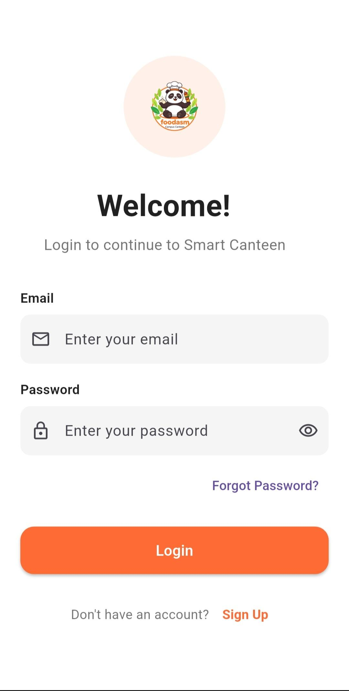
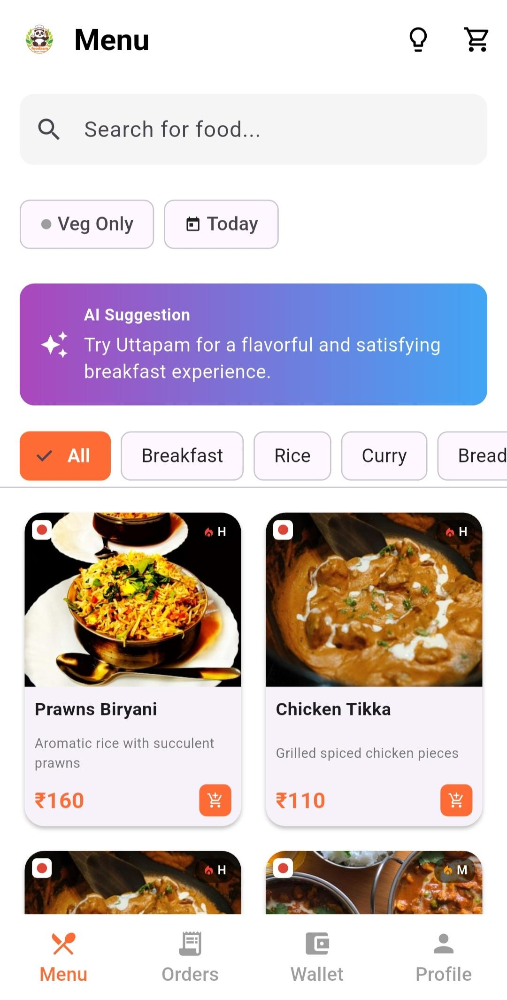
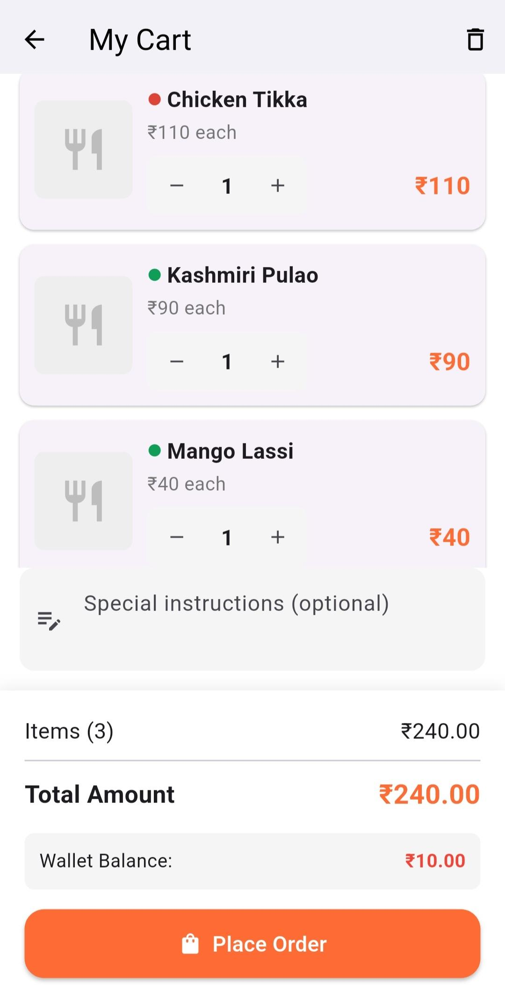
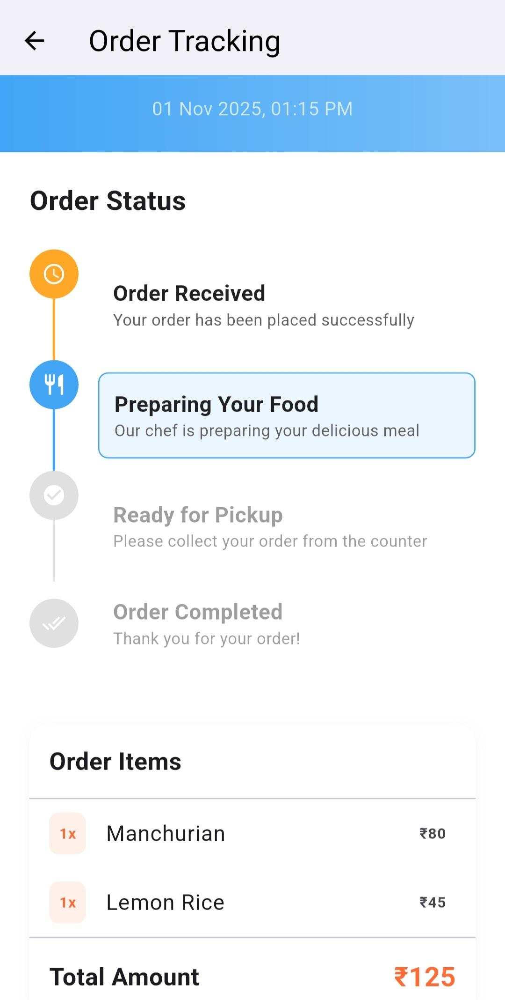
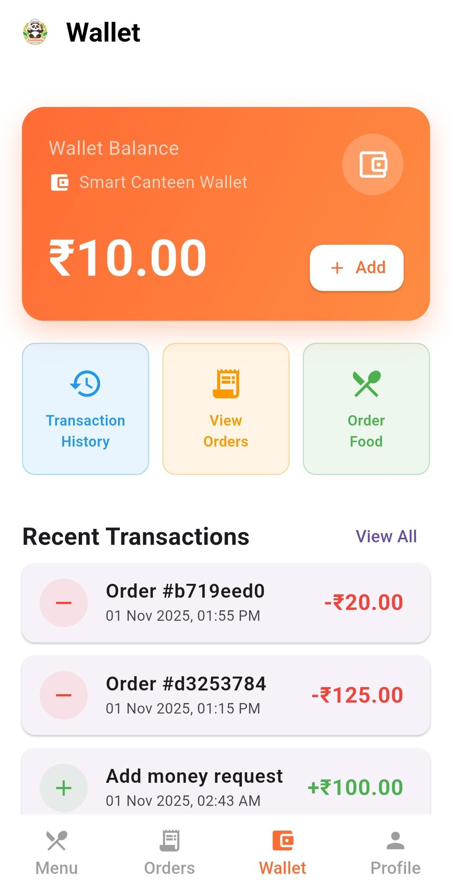
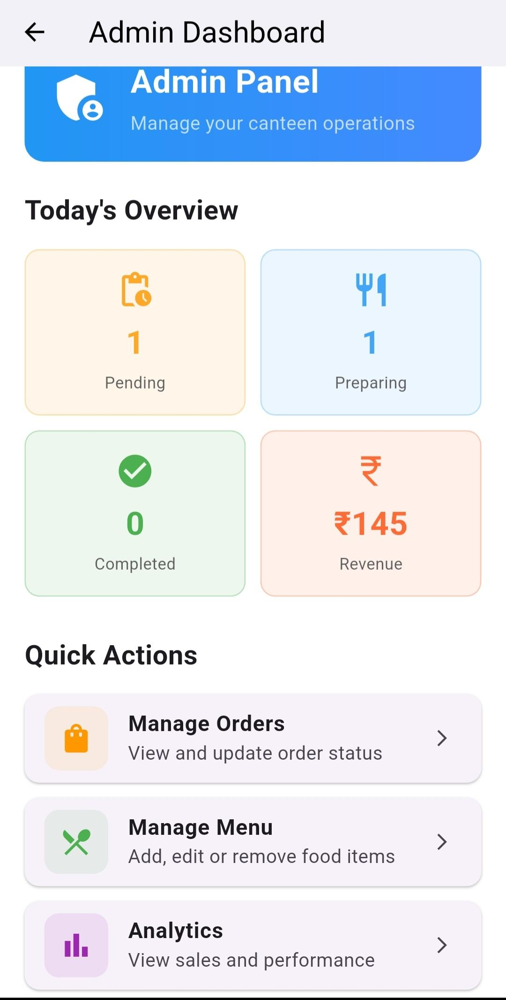
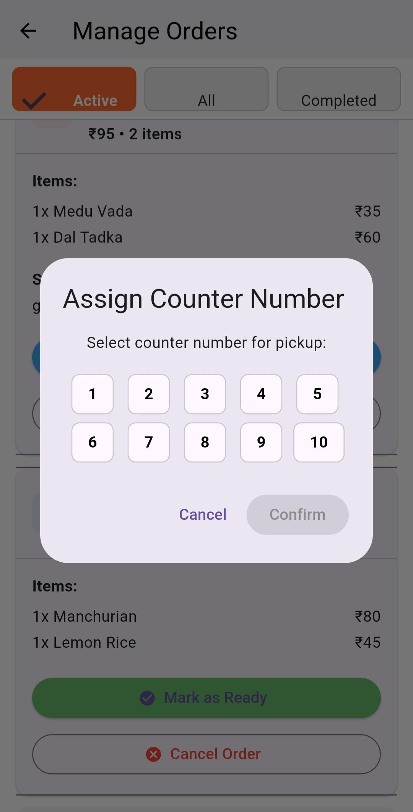
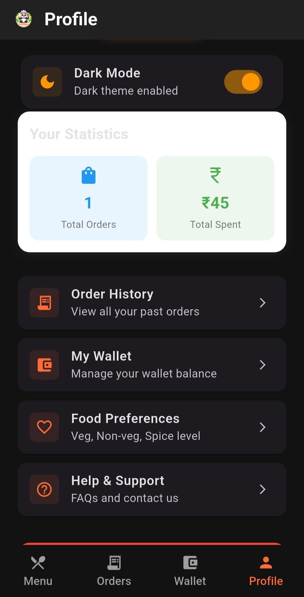
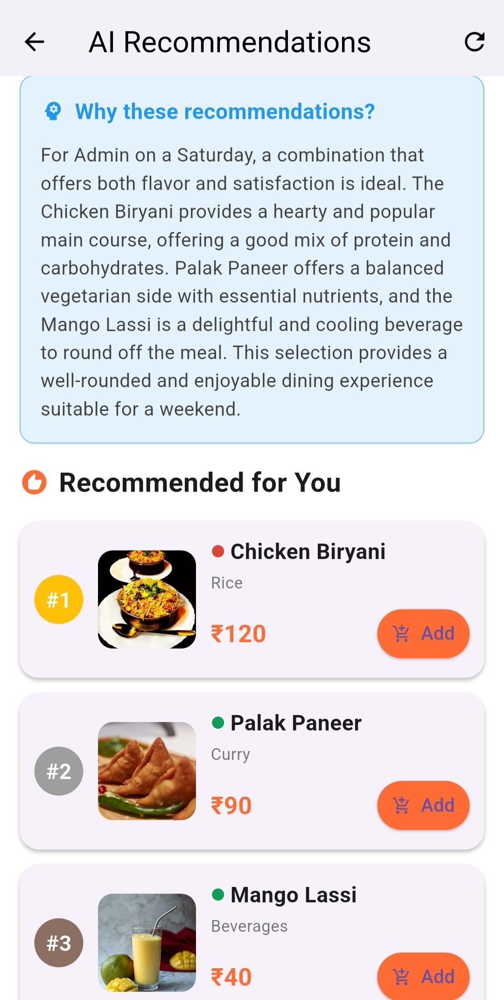

# 🍽️ FOODASM - Smart Canteen Token System

A comprehensive Flutter mobile application designed to digitize campus canteen operations with real-time order tracking, digital wallet system, and AI-powered food recommendations.

[](https://flutter.dev)
[](https://firebase.google.com)
[](https://dart.dev)
[](LICENSE)

---

## 📋 Table of Contents

- [Features](#-features)
- [Screenshots](#-screenshots)
- [Tech Stack](#-tech-stack)
- [Installation](#-installation)
- [Firebase Setup](#-firebase-setup)
- [Running the App](#-running-the-app)
- [Project Structure](#-project-structure)
- [API Integration](#-api-integration)
- [Testing](#-testing)
- [Contributing](#-contributing)
- [License](#-license)

---

## ✨ Features

### 🎓 For Students

- ✅ **Digital Wallet System** - Cashless transactions with ₹100 welcome bonus
- ✅ **Browse Menu** - 50+ authentic Indian food items with images
- ✅ **Smart Cart** - Add/remove items with real-time total calculation
- ✅ **Real-time Order Tracking** - Live updates from Pending → Preparing → Ready
- ✅ **AI Recommendations** - Personalized food suggestions using Gemini AI
- ✅ **Order History** - Complete transaction and order history
- ✅ **Dark Mode** - Eye-friendly theme switching
- ✅ **Profile Management** - Update preferences and view statistics

### 👨‍💼 For Administrators

- ✅ **Admin Dashboard** - Real-time statistics and analytics
- ✅ **Order Management** - View, update, and track all orders
- ✅ **Menu Control** - Add, edit, delete, and manage food items
- ✅ **Status Updates** - Change order status and assign counter numbers
- ✅ **Wallet Requests** - Approve/reject student wallet recharge requests
- ✅ **Analytics** - View sales trends, popular items, and revenue data

---

## 📱 Screenshots

| Login Screen | Menu Screen | Cart Screen | Order Tracking |
|:------------:|:-----------:|:-----------:|:--------------:|
|  |  |  |  |

| Wallet Screen | Admin Dashboard | Order Management | Dark Mode || Ai Recommendation |
|:-------------:|:---------------:|:----------------:|:---------:||:----------------: |
|  |  |  |  | ||  |

---

## 🛠️ Tech Stack

### Frontend
- **Framework:** Flutter 3.x
- **Language:** Dart
- **State Management:** Provider Pattern
- **UI:** Material Design 3

### Backend
- **Database:** Firebase Firestore (NoSQL)
- **Authentication:** Firebase Authentication
- **Storage:** Firebase Cloud Storage
- **Security:** Firebase Security Rules

### AI Integration
- **Service:** Google Gemini AI API
- **Purpose:** Personalized food recommendations

### Key Dependencies

```yaml
dependencies:
  flutter:
    sdk: flutter
  firebase_core: ^2.24.2
  firebase_auth: ^4.16.0
  cloud_firestore: ^4.14.0
  provider: ^6.1.1
  google_fonts: ^6.1.0
  google_generative_ai: ^0.2.1
  cached_network_image: ^3.3.1
  intl: ^0.18.1
  uuid: ^4.3.3
```

---

## 🏗️ Architecture

The app follows **MVVM (Model-View-ViewModel)** architecture with Provider pattern for state management:

```
lib/
├── models/          # Data models
├── services/        # Business logic & API calls
├── providers/       # State management
├── screens/         # UI screens
├── widgets/         # Reusable widgets
├── constants/       # App constants
└── config/          # Configuration files
```

**Data Flow:**
```
UI (Screens) → Provider → Service → Firebase → Service → Provider → UI
```

---

## 📥 Installation

### Prerequisites

- Flutter SDK (3.0 or higher)
- Dart SDK (3.0 or higher)
- Android Studio / VS Code
- Firebase Account
- Git

### Clone Repository

```bash
git clone https://github.com/YOUR_USERNAME/foodasm-smart-canteen.git
cd foodasm-smart-canteen
```

### Install Dependencies

```bash
flutter pub get
```

### Check Flutter Installation

```bash
flutter doctor
```

---

## 🔥 Firebase Setup

### Step 1: Create Firebase Project

1. Go to [Firebase Console](https://console.firebase.google.com)
2. Click "Add Project"
3. Name: `foodasm` (or your choice)
4. Enable Google Analytics (optional)
5. Create Project

### Step 2: Register Your App

**For Android:**
1. Click Android icon
2. Package name: `com.example.foodasm` (match with `android/app/build.gradle`)
3. Download `google-services.json`
4. Place in `android/app/` directory

**For iOS:**
1. Click iOS icon
2. Bundle ID: `com.example.foodasm` (match with Xcode project)
3. Download `GoogleService-Info.plist`
4. Place in `ios/Runner/` directory

### Step 3: Enable Firebase Services

**Authentication:**
1. Go to Authentication → Sign-in method
2. Enable "Email/Password"

**Firestore Database:**
1. Go to Firestore Database
2. Click "Create Database"
3. Start in **Test Mode** (for development)
4. Choose location (asia-south1 recommended for India)

**Storage:**
1. Go to Storage
2. Click "Get Started"
3. Start in Test Mode

### Step 4: Configure Firebase in Flutter

Run the FlutterFire CLI:

```bash
# Install FlutterFire CLI
dart pub global activate flutterfire_cli

# Configure Firebase
flutterfire configure --project=foodasm
```

This will generate `lib/firebase_options.dart` automatically.

### Step 5: Setup Firestore Security Rules

Go to Firestore → Rules and paste:

```javascript
rules_version = '2';
service cloud.firestore {
  match /databases/{database}/documents {
    
    match /users/{userId} {
      allow read: if request.auth != null;
      allow write: if request.auth.uid == userId;
    }
    
    match /menuItems/{itemId} {
      allow read: if true;
      allow write: if request.auth != null && 
        get(/databases/$(database)/documents/users/$(request.auth.uid)).data.isAdmin == true;
    }
    
    match /orders/{orderId} {
      allow read: if request.auth != null &&
        (resource.data.userId == request.auth.uid ||
        get(/databases/$(database)/documents/users/$(request.auth.uid)).data.isAdmin == true);
      allow create: if request.auth != null && 
        request.resource.data.userId == request.auth.uid;
      allow update: if request.auth != null &&
        get(/databases/$(database)/documents/users/$(request.auth.uid)).data.isAdmin == true;
    }
    
    match /transactions/{transactionId} {
      allow read: if request.auth != null && 
        resource.data.userId == request.auth.uid;
      allow create: if request.auth != null && 
        request.resource.data.userId == request.auth.uid;
    }
    
    match /walletRequests/{requestId} {
      allow read, write: if request.auth != null;
    }
  }
}
```

---

## 🎮 Running the App

### Development Mode

```bash
flutter run
```

### Build for Release

**Android APK:**
```bash
flutter build apk --release
```

**Android App Bundle:**
```bash
flutter build appbundle --release
```

**iOS:**
```bash
flutter build ios --release
```

---

## 📂 Project Structure

```
foodasm/
├── android/                 # Android native code
├── ios/                     # iOS native code
├── lib/
│   ├── main.dart           # App entry point
│   ├── firebase_options.dart
│   ├── constants/
│   │   ├── colors.dart     # App color scheme
│   │   └── food_data.dart  # 50 food items data
│   ├── config/
│   │   └── api_keys.dart   # API configuration (gitignored)
│   ├── models/
│   │   ├── user_model.dart
│   │   ├── menu_item.dart
│   │   ├── order_model.dart
│   │   └── wallet_transaction.dart
│   ├── services/
│   │   ├── auth_service.dart
│   │   ├── database_service.dart
│   │   ├── wallet_service.dart
│   │   └── ai_service.dart
│   ├── providers/
│   │   ├── user_provider.dart
│   │   ├── cart_provider.dart
│   │   ├── order_provider.dart
│   │   └── theme_provider.dart
│   ├── screens/
│   │   ├── splash_screen.dart
│   │   ├── auth/
│   │   ├── home/
│   │   ├── cart/
│   │   ├── orders/
│   │   ├── wallet/
│   │   ├── profile/
│   │   ├── recommendations/
│   │   └── admin/
│   └── widgets/
│       ├── custom_button.dart
│       ├── custom_textfield.dart
│       ├── menu_card.dart
│       ├── order_card.dart
│       └── loading_widget.dart
├── assets/
│   └── images/
│       └── logo.png
├── pubspec.yaml
├── .gitignore
├── README.md
└── LICENSE
```

---

## ⚙️ Configuration

### 1. API Keys Setup

Create `lib/config/api_keys.dart`:

```dart
class ApiKeys {
  static const String geminiApiKey = 'YOUR_GEMINI_API_KEY_HERE';
}
```

**Get Gemini API Key:**
1. Go to [Google AI Studio](https://makersuite.google.com/app/apikey)
2. Create API Key
3. Copy and paste in `api_keys.dart`

⚠️ **Note:** This file is gitignored for security. Never commit API keys!

### 2. Admin Account Setup

After first run, create admin account:

```dart
// Run this once in your app (create a button in dev mode)
await AuthService().createAdminAccount(
  email: 'admin@canteen.com',
  password: 'Admin@123',
  name: 'Admin',
  rollNumber: 'ADMIN001'
);
```

**Default Admin Credentials:**
- Email: `admin@canteen.com`
- Password: `Admin@123`

### 3. Wallet Password

Default wallet password for adding money: `Canteen@2024`

You can change this in `lib/services/wallet_service.dart`:

```dart
static const String WALLET_PASSWORD = 'Canteen@2024';
```

### 4. Initialize Menu Items

After setup, initialize the database with 50 food items:

```dart
// Run once (create a button in admin panel)
await DatabaseService().initializeMenuItems(INDIAN_FOOD_ITEMS);
```

---

## 🤖 API Integration

### Gemini AI Recommendations

The app uses Google's Gemini AI to provide personalized food recommendations.

**How it works:**
1. Collects user preferences (veg/non-veg)
2. Analyzes order history
3. Considers current time of day
4. Generates personalized suggestions

**Implementation in `lib/services/ai_service.dart`:**

```dart
Future<List<MenuItem>> getRecommendations({
  required String userName,
  required List<String> preferences,
  required List<String> orderHistory,
}) async {
  // API call to Gemini
  // Parse response
  // Return recommendations
}
```

---

## 🧪 Testing

### Run Tests

```bash
flutter test
```

### Test Coverage

```bash
flutter test --coverage
```


## 🤝 Contributing

Contributions are welcome! Please follow these steps:

1. Fork the repository
2. Create your feature branch (`git checkout -b feature/AmazingFeature`)
3. Commit your changes (`git commit -m 'Add some AmazingFeature'`)
4. Push to the branch (`git push origin feature/AmazingFeature`)
5. Open a Pull Request


## 📄 License

This project is licensed under the MIT License - see the [LICENSE](LICENSE) file for details.

---


